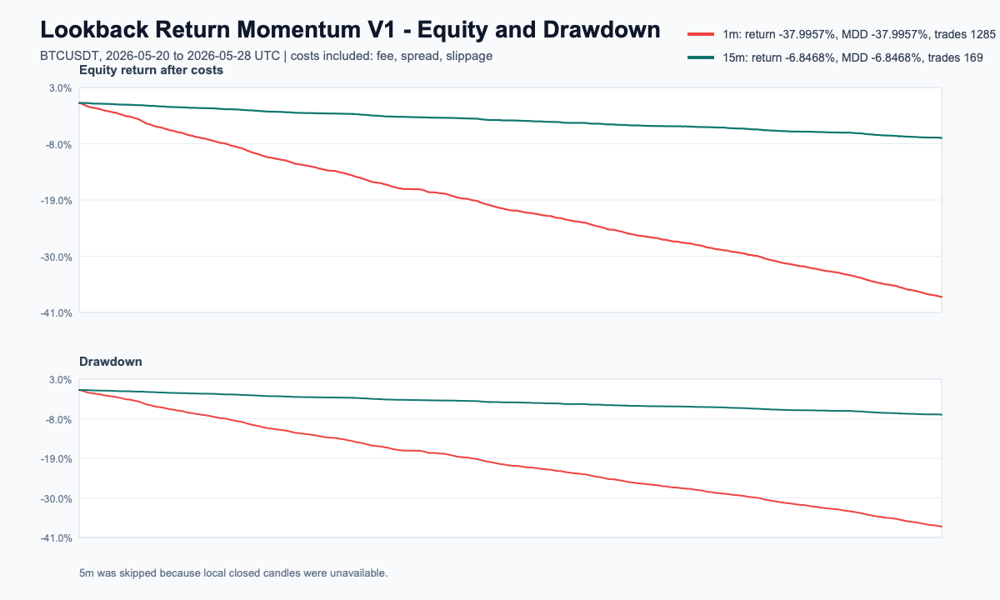
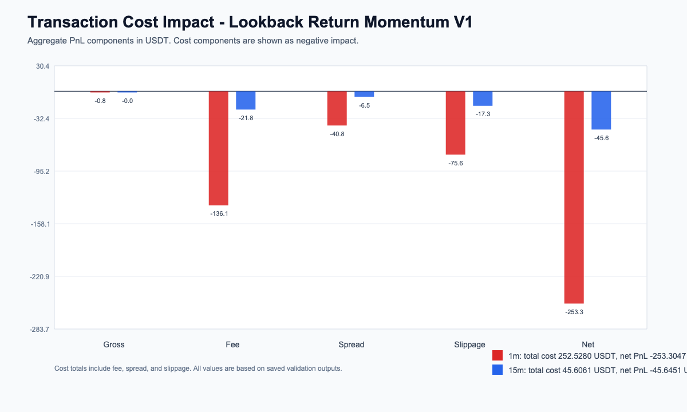
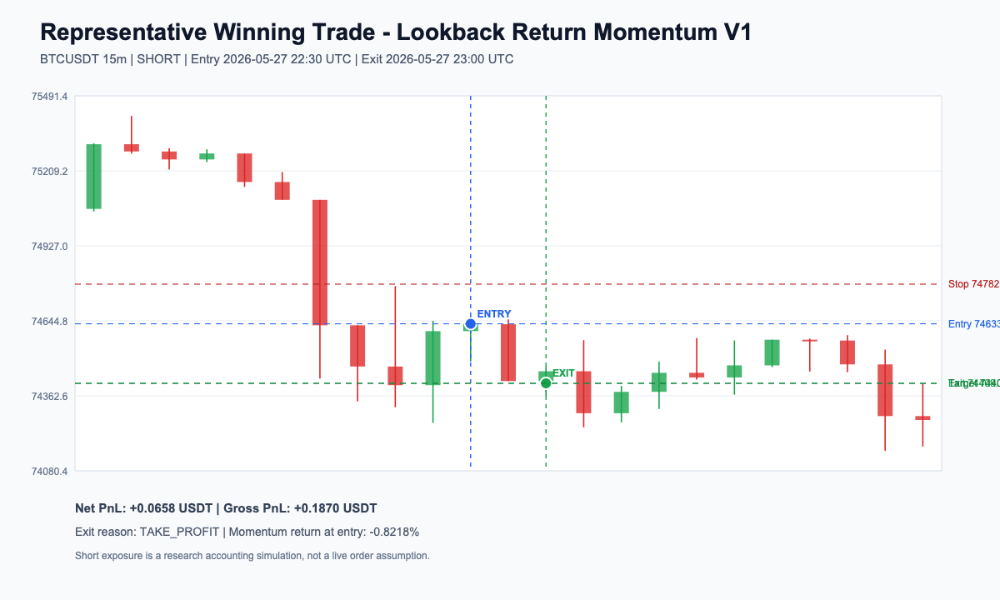
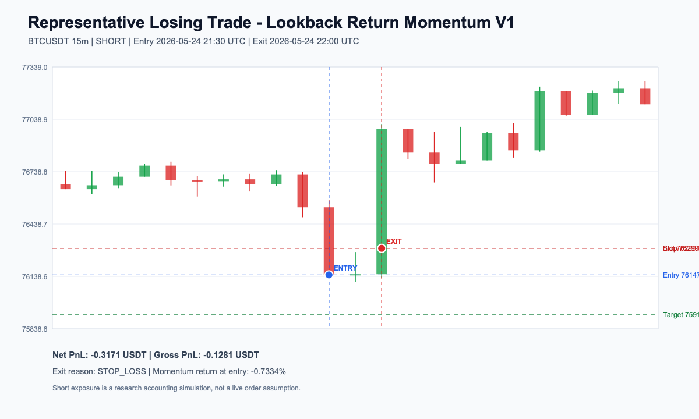

# Lookback Return Momentum V1 백테스트 리포트

## 1. 핵심 요약

1m 1,285 trades. 15m 169 trades. 거래비용을 반영한 뒤에는 두 결과 모두 순손익과 기대값이 음수였습니다.

Lookback Return Momentum V1은 Binance BTCUSDT에서 최근 완료봉 수익률이 기준을 넘으면 같은 방향으로 진입하는 기초 모멘텀 전략입니다. 2026-05-20 00:00 UTC부터 2026-05-28 08:15 UTC까지 1분봉과 15분봉 기본값을 비교했습니다.



수익 곡선은 두 타임프레임 모두 아래로 이동했습니다. 1분봉은 -37.9957%, 15분봉은 -6.8468%로 끝났습니다.

핵심은 거래비용입니다. 비용 차감 전 손익도 1분봉 -0.7767 USDT, 15분봉 -0.0390 USDT에 그쳤고, 수수료와 슬리피지를 반영한 뒤 손실이 크게 커졌습니다.

### 테스트 개요

| 항목 | 내용 |
|---|---|
| 시장/심볼 | Binance BTCUSDT |
| 타임프레임 | 1m, 15m |
| 기간 | 2026-05-20 00:00 UTC ~ 2026-05-28 08:15 UTC |
| 비교 변인 | 1m 기본값과 15m 기본값 |
| 진입 조건 | 최근 N개 완료봉 수익률 기준 돌파 |
| 청산 조건 | 손절 1.0R, 익절 1.5R, 시간 청산 |
| 비용 조건 | 수수료, 스프레드, 슬리피지 반영 |
| 포지션 사이징 | 거래당 사용 가능 현금의 10% |
| PR | [확인 필요] |

### 핵심 수치

| 지표 | 1m | 15m |
|---|---:|---:|
| 총 거래 수 | 1,285회 | 169회 |
| 승률 | 0.00% | 0.00% |
| 총 수익률 | -37.9957% | -6.8468% |
| 최대 낙폭 | -37.9957% | -6.8468% |
| 순손익 | -253.3047 USDT | -45.6451 USDT |
| Expectancy | -0.1971 USDT | -0.2693 USDT |
| Profit Factor | 0.0000 | 0.0000 |

한 줄로 정리하면, 비용 차감 전에도 충분한 수익이 없었고 비용 반영 후에는 손실 구조가 뚜렷해졌습니다.

## 2. 가설

이번 백테스트에서는 다음 가설을 검증할 것입니다.

- 최근 N개 완료봉 수익률이 기준 이상이면 이후 holding_bars 동안 같은 상승 방향 수익률을 보일 것이다.
- 최근 N개 완료봉 수익률이 기준 이하이면 이후 holding_bars 동안 같은 하락 방향 수익률을 보일 것이다.

## 3. 전략에 포함된 가정과 이론적 배경

이번 전략에는 다음 가정이 들어 있습니다.

- 짧은 구간의 가격 이동은 일부 구간에서 다음 구간까지 이어질 수 있습니다.
- 신호가 충분히 강하면 손절, 익절, 시간 청산 구조 안에서 비용을 넘길 수 있습니다.
- 추세 필터나 거래량 필터 없이도 순수 모멘텀 신호의 기본 성격을 확인할 수 있습니다.

이 전략은 단기 모멘텀 관점에서 의미를 가집니다.

최근 close-to-close 수익률은 짧은 시간 동안 가격이 한 방향으로 밀리는 현상을 포착하기 위한 신호입니다. 가격이 일정 기준 이상 움직이면 그 방향의 주문 흐름이 조금 더 이어질 가능성이 있다고 보고 진입합니다.

전략의 유효성은 비용 반영 후 기대값으로 판단합니다.

```text
E[R] = P(win) × AvgWin - P(loss) × AvgLoss - Cost
```

이번 결과에서는 기대값이 1분봉 -0.1971 USDT, 15분봉 -0.2693 USDT였습니다. 두 값 모두 음수였습니다.

## 4. 전략 규칙

### 사용 지표와 패턴

| 항목 | 내용 |
|---|---|
| 패턴 | 없음 |
| 지표 | 최근 N개 완료봉의 close-to-close 수익률 |
| 진입 방향 | Long / Short |
| 필터 조건 | 없음 |

### 진입 조건

Long 진입 조건:

- 포지션이 없을 때만 진입합니다.
- 최근 N개 완료봉 수익률이 entry_threshold 이상이어야 합니다.
- 1분봉 기본값은 lookback 20, threshold 0.1%입니다.
- 15분봉 기본값은 lookback 8, threshold 0.2%입니다.

Short 진입 조건:

- 포지션이 없을 때만 진입합니다.
- 최근 N개 완료봉 수익률이 -entry_threshold 이하이어야 합니다.
- Short는 실거래 주문이 아니라 연구용 가상 포지션으로 처리했습니다.

### 청산 조건

| 항목 | 내용 |
|---|---|
| 손절 기준 | 진입가에서 0.2%를 1R로 두고 1.0R 손절 |
| 익절 기준 | 1.5R 익절 |
| 시간 제한 | 1분봉 5개 봉, 15분봉 4개 봉 |
| 반대 신호 처리 | 포지션을 뒤집지 않고 기존 청산 규칙만 사용 |

### 비용 조건

- 수수료, 스프레드, 슬리피지를 진입과 청산에 모두 반영했습니다.
- 진입은 완료봉 종가 기준의 오프라인 체결로 처리했습니다.
- 실제 주문은 넣지 않았습니다.

## 5. 백테스트 설정

| 항목 | 내용 |
|---|---|
| 거래소 | Binance public market data |
| 심볼 | BTCUSDT |
| 시장 | Spot 기준 오프라인 백테스트 |
| 기간 | 2026-05-20 00:00 UTC ~ 2026-05-28 08:15 UTC |
| 타임프레임 | 1m, 15m |
| 비교 변인 | 기본 파라미터의 타임프레임 차이 |
| 초기 자본 | 1,000,000 KRW를 666.6667 USDT로 환산 |
| 포지션 사이징 | 거래당 사용 가능 현금의 10% |

이번 백테스트는 OHLCV 데이터를 기준으로 수행했습니다.

캔들 내부에서 손절과 익절이 모두 가능한 경우에는 손절이 먼저 발생한 것으로 처리했습니다.

5분봉은 local closed candles가 없어 이번 검증에서 제외했습니다.

## 6. 결과

### 6.1 대표 결과


| 지표 | 1m | 15m |
|---|---:|---:|
| 최종 자본 | 413.3620 USDT | 621.0216 USDT |
| 총 수익률 | -37.9957% | -6.8468% |
| 총 거래 수 | 1,285회 | 169회 |
| 승률 | 0.00% | 0.00% |
| 평균 이익 | [확인 필요] | [확인 필요] |
| 평균 손실 | -0.1971 USDT | -0.2693 USDT |
| Expectancy | -0.1971 USDT | -0.2693 USDT |
| Profit Factor | 0.0000 | 0.0000 |
| Max Drawdown | -37.9957% | -6.8468% |
| Sharpe | -346.6343 | -115.5526 |
| Sortino | -320.7748 | -101.7054 |

두 타임프레임 모두 순손익과 기대값이 음수였습니다. 1분봉은 거래 수가 많았고, 그만큼 비용 누적도 컸습니다.

### 6.2 타임프레임 비교

대표 그래프 안에서 1분봉과 15분봉 수익 곡선 및 낙폭을 함께 비교했습니다. 별도 변인별 이미지는 만들지 않았습니다.

| 타임프레임 | 변인 | 수익률 | 최대 낙폭 | Expectancy | 해석 |
|---|---|---:|---:|---:|---|
| 1m | lookback 20 / hold 5 | -37.9957% | -37.9957% | -0.1971 USDT | 거래 수가 많았고 비용 누적이 순손실 대부분을 차지했습니다. |
| 15m | lookback 8 / hold 4 | -6.8468% | -6.8468% | -0.2693 USDT | 거래 수는 줄었지만 비용 반영 후 기대값이 음수였습니다. |

### 6.3 거래비용 영향



| 비용 단계 | 1m | 15m |
|---|---:|---:|
| 비용 미반영 손익 | -0.7767 USDT | -0.0390 USDT |
| 수수료 반영 후 손익 | -136.8796 USDT | -21.8315 USDT |
| 수수료 + 스프레드 반영 후 손익 | -177.7104 USDT | -28.3693 USDT |
| 수수료 + 스프레드 + 슬리피지 반영 후 손익 | -253.3047 USDT | -45.6451 USDT |
| 총 거래비용 | 252.5280 USDT | 45.6061 USDT |

비용 미반영 손익은 두 타임프레임 모두 거의 없거나 음수였습니다. 수수료, 스프레드, 슬리피지를 반영하자 손실 폭이 커졌습니다.

특히 1분봉은 순손실 -253.3047 USDT 중 252.5280 USDT가 거래비용에서 나왔습니다. 이 구조에서는 신호가 조금 맞아도 비용을 넘기 어렵습니다.

## 7. 주의해서 볼 점

이번 결과에서 주의해서 봐야 할 점은 다음과 같습니다.

- 1분봉은 거래 수가 많아 비용 누적이 순손실 대부분을 차지했습니다.
- 15분봉은 거래 수를 줄였지만, 비용 반영 후 순손익과 기대값이 여전히 음수였습니다.
- 이번 구간은 첫 진단 구간이며, 5분봉은 local closed candles가 없어 비교하지 못했습니다.

## 8. 대표 거래

### 대표 수익 거래



| 항목 | 내용 |
|---|---|
| 진입 이유 | 15분봉 Short 모멘텀 조건 충족 |
| 청산 이유 | 익절 가격 도달 |
| 순손익 | +0.0658 USDT |

이 거래에서는 전략이 의도한 단기 하락 추종 구조가 나타났습니다.

진입 이후 가격이 아래로 움직였고, 익절 기준에 따라 수익으로 종료되었습니다. 다만 이 거래 하나가 전체 손익 구조를 바꾸지는 못했습니다.

### 대표 손실 거래



| 항목 | 내용 |
|---|---|
| 진입 이유 | 15분봉 Short 모멘텀 조건 충족 |
| 청산 이유 | 반대 방향 이동 후 손절 도달 |
| 순손익 | -0.3171 USDT |

이 거래에서는 짧은 모멘텀 신호가 바로 이어지지 않아 손실이 발생했습니다.

추세 필터가 없는 상태에서 Short 신호가 반전 구간에 걸리면 손절이 빠르게 나올 수 있습니다.

## 9. 해석

이번 백테스트에서 확인한 내용은 다음과 같습니다.

- 비용 미반영 손익부터 충분하지 않았습니다.
- 비용 반영 후에는 1분봉 -253.3047 USDT, 15분봉 -45.6451 USDT로 손실이 커졌습니다.
- Long과 Short 모두 비용 반영 후 순손익이 음수였습니다.

Lookback Return Momentum V1은 짧은 추세 추종 아이디어를 확인하는 기초 실험으로는 의미가 있습니다. 하지만 이번 조건에서는 신호 수익보다 비용 누적이 더 컸습니다.

따라서 이번 결과를 전략 우위로 일반화하기는 어렵습니다.

## 10. 결론

이번 백테스트에서는 Lookback Return Momentum V1의 기본값이 거래비용을 넘지 못했습니다.

현재 결과만 기준으로 보면 실거래 후보로 보기는 어렵습니다. 다음 판단을 하려면 5분봉 데이터 보강이나 별도 검증 구간 설계가 먼저 필요합니다.
